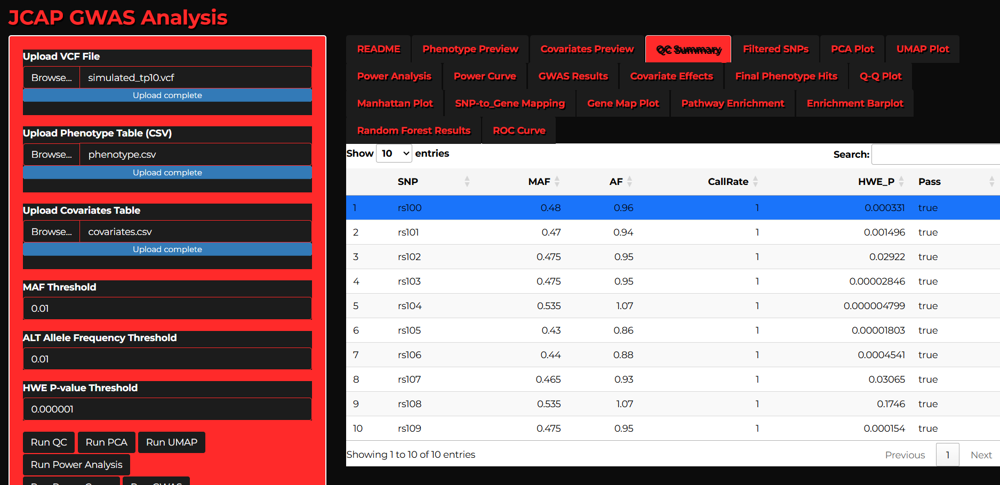
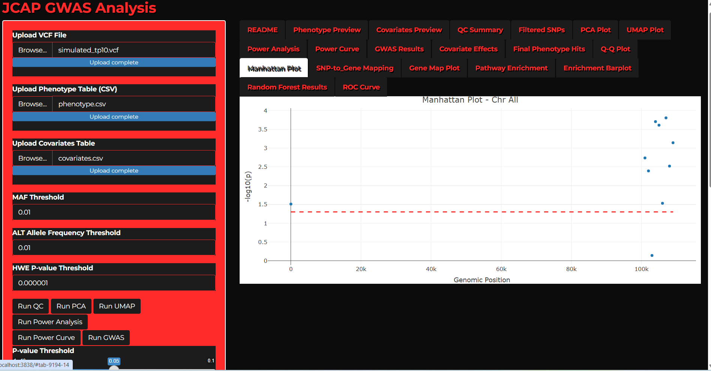
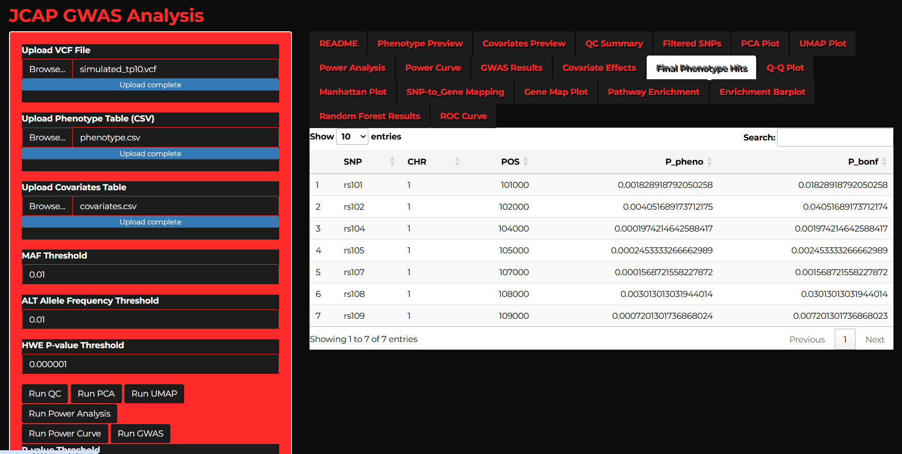
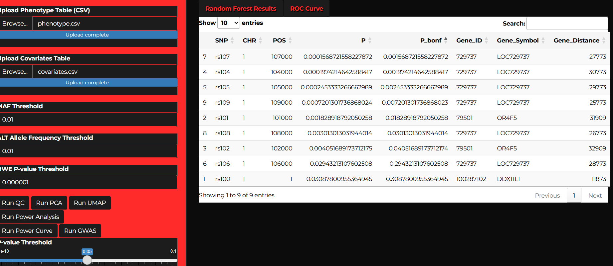
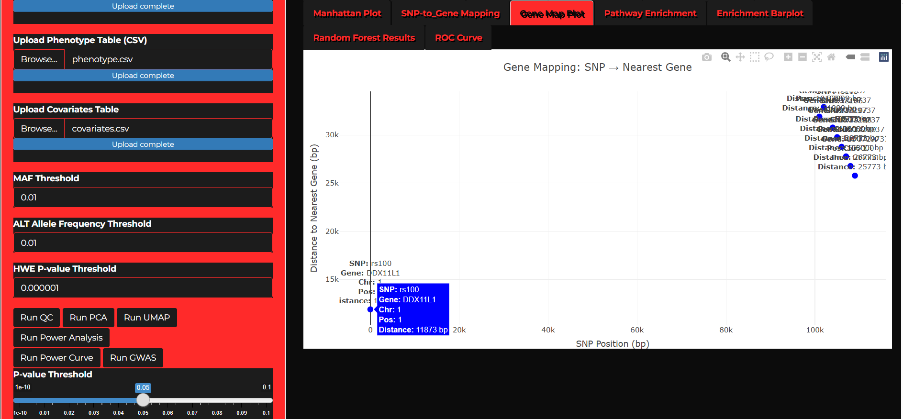

# 🧬 JCAP GWAS Shiny App

A complete, interactive platform for performing QC, GWAS, ML modeling, gene mapping, enrichment, and predictive analysis — powered by **Shiny** and ready for **HPC deployment via Singularity**.

---

## 🔗 Table of Contents

1. [Features](#features)
2. [Screenshots](#screenshots)
3. [Tech Stack](#tech-stack)
4. [Installation](#installation)
   - [Run Locally](#run-locally)
   - [Run with Singularity (HPC)](#run-with-singularity-hpc)
5. [How to Use](#how-to-use)
6. [Downloadable Outputs](#downloadable-outputs)
7. [Common Errors](#common-errors)
8. [Credits & Contact](#credits--contact)

---

## 🚀 Features

- 📤 Upload your own **VCF**, **phenotype**, and **covariate** data
- ✅ Perform **SNP Quality Control** with MAF, HWE, and Call Rate thresholds
- 📊 Explore data via **PCA** and **UMAP** projections
- 🔬 Run **GWAS** with Bonferroni option and adjustable p-value slider
- 🧪 View **Q-Q** and **Manhattan** plots with chromosome/position filters
- 🧬 Map SNPs to nearest **human genes**
- 🧭 Perform **Pathway Enrichment Analysis** with barplots for KEGG, GO, and Reactome
- 🤖 Train/test a **Random Forest model** using significant SNPs
- 📈 Inspect **model predictions**, **AUC**, **sensitivity/specificity**, and **variable importance**
- 📉 Run **power analysis** with effect size and power curves
- 🧾 Export all results as CSV

---

## 📸 Screenshots

### 🧪 QC Summary Table

---

### 🌋 Manhattan Plot

---

### 📊 GWAS Results Table

---

### 🧬 SNP → Gene Table

---

### 🧬 Gene Mapping Plot

## 🧱 Tech Stack

- **R 4.x** via [`rocker/shiny`](https://hub.docker.com/r/rocker/shiny)
- Shiny + `data.table`, `DT`, `plotly`, `ranger`, `mlr3`, `VariantAnnotation`, `enrichR`, `pwr`, `ROCR`
- Containerized using **Singularity**
- Designed for HPC **cluster-friendly** use

---

## 🔧 Installation

### 📦 Run Locally (with R)

1. Clone this repo:
   in `bash
   git clone https://github.com/jcaperella29/GWAS_SHINY_APP
   cd GWAS_SHINY_APP

2.Launch the app
in R

shiny::runApp()

Make sure required R packages are installed (listed in app.R)

###⚗️ Run with Singularity and SLURM (HPC)

1.Build container:

in bash
sudo singularity build gwas_app.sif Singularity.def

2. Submit the app to SLURM
Use the included SLURM batch script to launch the Shiny app in a containerized HPC environment:

in bash
sbatch run_gwas_app.slurm

This will:

Launch the app inside the container

Bind it to 0.0.0.0 on port 3838

Generate a log file: gwas_shiny.log

3. Access the app
If you're on WSL or a local machine:

Open your browser and go to:
http://localhost:3838
If you're running on a remote VM:

ssh -L 3838:localhost:3838 your_user@your_server_ip

Then visit:

http://localhost:3838

🧭 How to Use
Upload Data
Upload VCF, phenotype (CSV), and optional covariates (CSV)

Run QC
Click Run QC button after adjusting MAF/HWE/Call Rate thresholds

Explore Data
Visualize sample space with PCA and UMAP

Power Analysis
Hit Run Power to estimate statistical power and see the power curve

Run GWAS
Adjust the p-value slider and choose Bonferroni if needed, then click Run GWAS

Visualize GWAS
Use Q-Q plot and Manhattan plot (adjust chr/position filters as needed)

Map SNPs to Genes
Click Map Genes and view table + plot

Run Enrichment
Perform pathway enrichment and view top results via Barplot

Run Random Forest
Train/test classifier on final hits. View predictions, metrics, and SNP importance

Download Outputs
Use sidebar download buttons to get CSVs of all results

📥 Downloadable Outputs
GWAS full results

Covariate associations

Final phenotype-only hits

SNP-to-gene annotation

Pathway enrichment table

Power analysis summary

Random forest predictions, metrics, and feature importance

❌ Common Errors
Error	Cause	Solution
Not enough samples in one or both groups	Trait imbalance	Ensure both classes are represented
Can't read output 'rfPredictions'	RF model not trained	Click Run Random Forest first
Gene mapping failed	Invalid SNP coordinates or gene DB issue	Check VCF chr formatting (should match hg19)
Enrichment failed	Too few gene symbols	Ensure gene mapping produced valid symbols
Package not found	Singularity not built properly	Rebuild container with correct R packages
Some enrichment databases may return no matching pathways for the genes mapped in your dataset.
If this happens, the app may display a “character(0)” or “no enrichment results for this database” message.

This simply means that the selected database does not contain any pathways associated with your gene list.
Try selecting another enrichment database (e.g., KEGG, GO Biological Process, or Reactome), as results often vary between them.

In addition to the main enrichment table, the app also generates a Pathway–Gene Edges file, which lists each enriched term alongside its contributing genes. This file can be downloaded and used for network visualizations or downstream analyses.

🙋‍♂️ Credits & Contact
🔬 App by John Caperella

